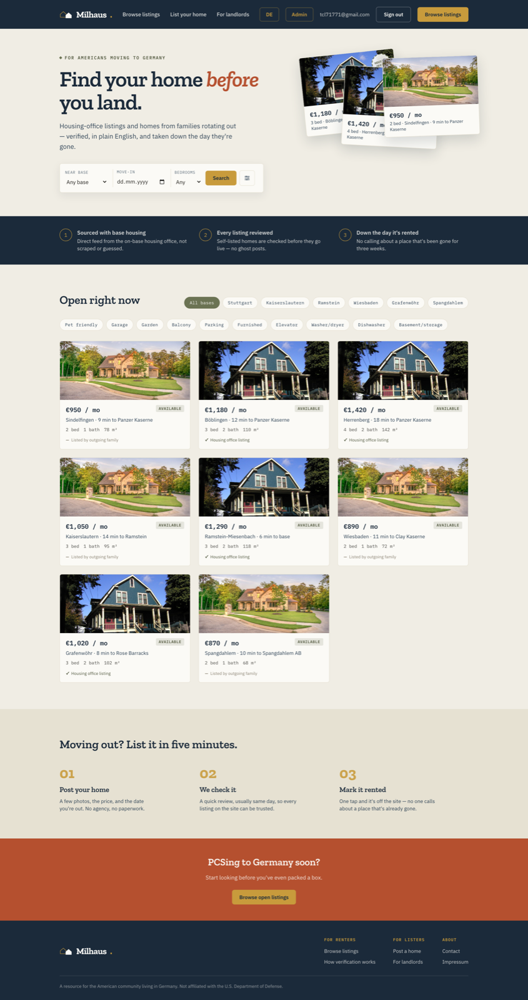
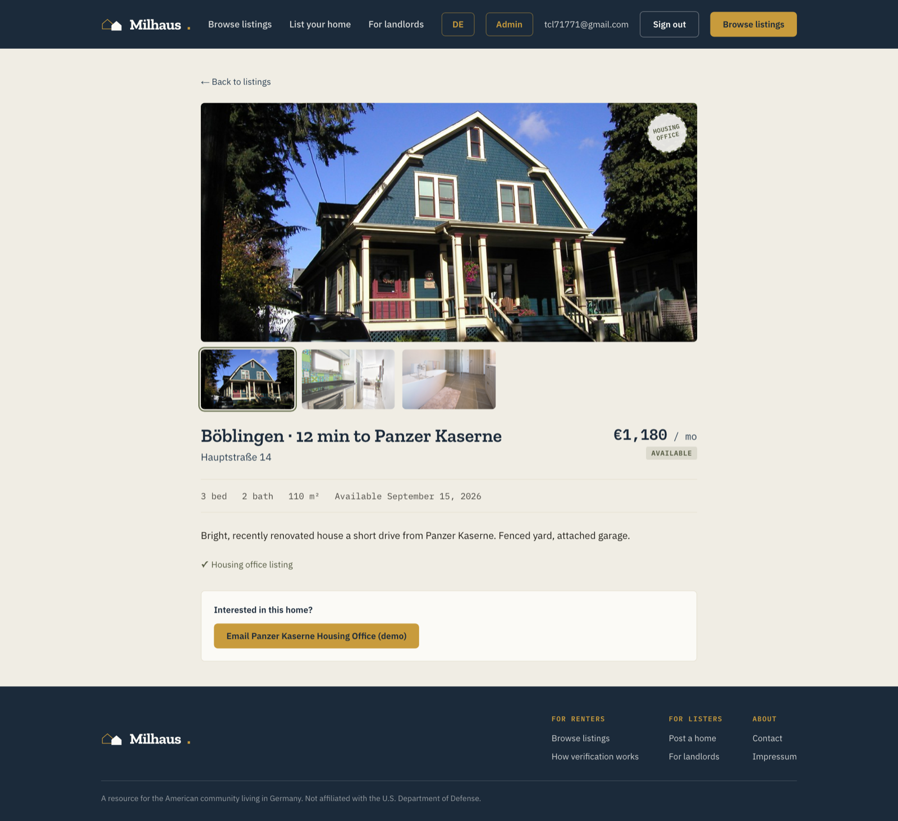
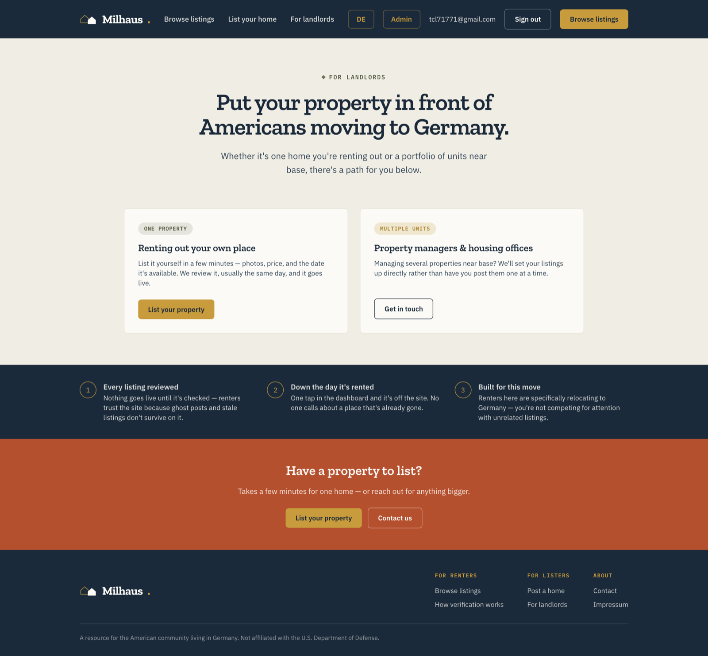
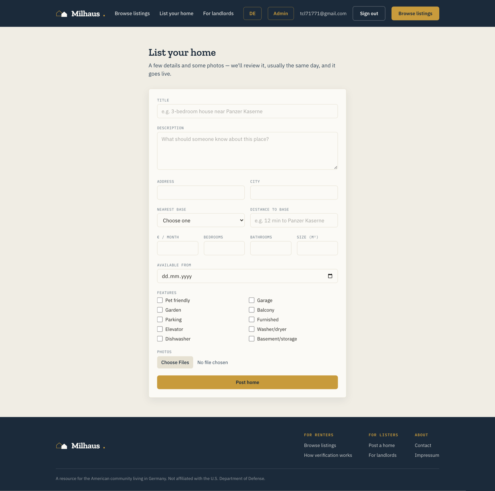
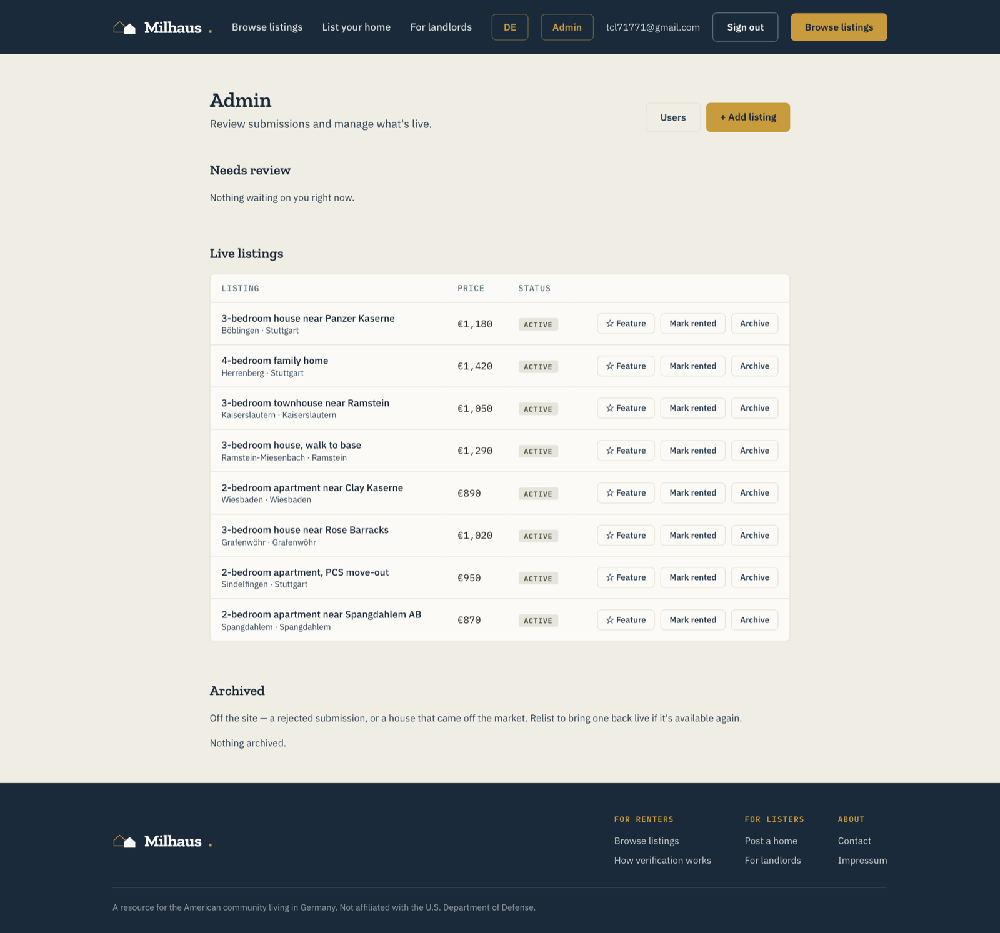

# Milhaus

A rental-listing marketplace for Americans relocating to Germany — military
and expat. It pairs the structure of a real-estate portal with the
low-friction posting of a classifieds board, drawing on two supply sources:

- **Housing-office listings** — homes sourced from an on-base housing office,
  marked with the dashed-circle **"stamp"** badge.
- **Self-listed homes** — families rotating out (PCS) listing the place
  they're leaving.

Every self-listed submission is reviewed by an admin before it goes live, and
listings come down the day they're rented. See [CLAUDE.md](./CLAUDE.md) for
the full product brief; [design-reference/milhaus-landing-mockup.html](./design-reference/milhaus-landing-mockup.html)
is the source of truth for visual direction (colours, type, layout).

## Screens

| | |
|---|---|
| **Landing + browse** — hero, filter chips by base and amenity, listing grid | **Listing detail** — photo gallery, the "housing office" stamp, contact |
| [](./docs/screenshots/01-home.png) | [](./docs/screenshots/02-listing-detail.png) |
| **For landlords** — two paths: self-list, or hand a portfolio to the admin | **Post a listing** — one form, defaults to `pending_review` |
| [](./docs/screenshots/03-for-landlords.png) | [](./docs/screenshots/04-post.png) |

**Admin dashboard** — the review queue, the live-listings table with one-click
status changes, and the archive. Built to be run solo by a non-technical
stakeholder.

[](./docs/screenshots/05-admin.png)

_Listings and photos above are demo data (`node scripts/seed-demo-listings.mjs`);
the photos are CC0._

## Status

MVP feature-complete against the build plan in CLAUDE.md (scaffold → design
system → browse → listing detail → auth → post-a-listing → admin dashboard →
SEO → monitoring). Not yet built: legal pages (Impressum, privacy, terms), a
lister-facing "my listings" area, email notifications, custom SMTP for
production. Not in scope: car listings, payments, housing-office bulk import.

## Stack

| | |
|---|---|
| Framework | Next.js 16 (App Router, TypeScript, Turbopack) |
| Backend | Supabase — Postgres + Row Level Security, Auth (magic link), Storage |
| Styling | Tailwind CSS v4 (theme derived from the mockup's design tokens) |
| i18n | next-intl — English (default, no prefix) and German (`/de`) |
| Hosting | Vercel |
| Monitoring | Sentry (`@sentry/nextjs`) + Vercel Analytics |

## Prerequisites

- Node.js 20.9+ and npm
- A Supabase project (free tier is fine)
- The [Supabase CLI](https://supabase.com/docs/guides/local-development) —
  optional, only for `supabase db push`

## Local setup

```bash
npm install
cp .env.example .env.local     # fill in the values below
npm run dev                     # http://localhost:3000
```

### Environment variables

All are documented inline in [.env.example](./.env.example). The three you
need to run the app at all:

| Variable | Where to find it |
|---|---|
| `NEXT_PUBLIC_SUPABASE_URL` | Supabase dashboard → Project Settings → API |
| `NEXT_PUBLIC_SUPABASE_ANON_KEY` | same page — safe to expose, RLS-constrained |
| `SUPABASE_SERVICE_ROLE_KEY` | same page — **server-only**, bypasses RLS (used by the seed script and the dev sign-in route) |

Optional: `NEXT_PUBLIC_SITE_URL`, `NEXT_PUBLIC_GOOGLE_SITE_VERIFICATION`,
`NEXT_PUBLIC_SENTRY_DSN`, and `SENTRY_ORG` / `SENTRY_PROJECT` /
`SENTRY_AUTH_TOKEN` (source-map upload only). Everything degrades gracefully
when they're unset. Never commit `.env.local`.

### Supabase project setup

Full walkthrough in [supabase/SETUP.md](./supabase/SETUP.md). In short:

1. **Schema** — run the migrations in [supabase/migrations/](./supabase/migrations/)
   (paste `20260821095414_init_schema.sql` then the rest into the SQL Editor,
   or `supabase link` + `supabase db push`). This creates the `profiles` and
   `listings` tables, their RLS policies, and the `listing-photos` bucket.
2. **Magic-link email template** — paste
   [supabase/templates/magic_link.html](./supabase/templates/magic_link.html)
   into Authentication → Email Templates → Magic Link.
3. **URL config** — set Site URL and add `http://localhost:3000/**` (plus the
   deployed domain) to Redirect URLs.
4. **First admin** — sign in once through the app, then in the SQL Editor:
   ```sql
   update public.profiles set role = 'admin' where contact_email = 'you@example.com';
   ```

### Signing in during development

The shared Supabase mailer is capped at **2 emails/hour**, and magic-link
tokens get spent by email/browser link scanners. So for local work:

```
http://localhost:3000/auth/dev-signin?email=you@example.com
```

Signs you in with no email round-trip. It 404s unless `NODE_ENV` is
`development` and the request is on localhost — inert in production.

The real magic-link flow (`/sign-in`) also works: it delivers both a
click-to-confirm link and a 6-digit code, either of which completes sign-in.

### Demo data

```bash
node scripts/seed-demo-listings.mjs
```

Creates two demo owner accounts and a handful of listings with real CC0
photos, for showing the site before real inventory exists. Rerunnable; see
the header comment in the script to remove the demo data.

## Scripts

| Command | |
|---|---|
| `npm run dev` | Dev server (Turbopack) on :3000 |
| `npm run build` | Production build |
| `npm run start` | Serve the production build |
| `npm run lint` | ESLint |

## Project layout

```
src/
  app/
    [locale]/            Public site — locale-scoped (/, /de/...)
      page.tsx             Landing + browse (grid, filters, stamp badges)
      listings/[id]/       Listing detail
      post/                Post-a-listing form (auth required)
      sign-in/             Magic-link sign-in
      for-landlords/       Marketing
      how-verification-works/
    admin/               Admin dashboard — English-only, outside [locale]
      page.tsx              Review queue + live/archived tables
      listings/new/         Admin add-a-listing
      users/                Role management
    auth/                Auth route handlers (outside [locale])
      confirm/              Magic-link interstitial (button → server action)
      dev-signin/           Dev-only sign-in shortcut
      sign-out/
    sitemap.ts, robots.ts, icon.tsx, apple-icon.tsx
  components/            UI (listing card, stamp badge, filter modal, forms, ...)
  lib/
    supabase/             Browser + server client factories
    listings.ts, profiles.ts    Typed server-side reads
    types.ts              Shared domain types (mirrors the DB)
    bases.ts, amenities.ts, roles.ts    Fixed vocab + the admin-role check
  i18n/                  next-intl routing/navigation
  proxy.ts              Middleware: locale routing + Supabase session refresh
messages/               en.json / de.json translation catalogues
supabase/               Migrations, templates, SETUP.md
design-reference/       The approved landing-page mockup
scripts/                Demo-data seed + its CC0 photos
```

## Data model

Two tables (see [supabase/migrations/20260821095414_init_schema.sql](./supabase/migrations/20260821095414_init_schema.sql)):

- **`listings`** — `type` (`rental`, enum-extensible for a future `car`),
  title/description, address/city/`base`/`distance_to_base`, price, beds,
  baths, size, `available_from`, `photos[]`, `amenities[]`,
  `source` (`housing_office` | `self_listed`),
  `status` (`draft` → `pending_review` → `active` → `rented` → `archived`),
  `is_featured`, `is_promoted` (reserved for a future paid tier), `owner_id`.
- **`profiles`** — one row per auth user; `role` is one of
  `owner` · `admin` · `housing_office_partner` · `landlord` ·
  `individual_lister`.

**Security lives in the database.** RLS scopes every read (the public sees
only `status = 'active'`; owners see their own; admins see all), and DB
triggers enforce the invariants — a non-admin can't flip a listing to
`active`, and a non-admin can't escalate their own role. The Next.js layer
mostly shapes queries and trusts RLS to do the gatekeeping.

`owner` and `admin` are functionally equal today (`isAdminRole` in
[src/lib/roles.ts](./src/lib/roles.ts) is the single check); `owner` is the
stakeholder, `admin` is whoever operates the site.

## Internationalisation

English is unprefixed (`/`, `/listings/…`); German is `/de/…`. Locale
detection is **off** — a fresh page load always starts in English; switching
to German carries forward only through in-app navigation. The `/admin` tree
is English-only and sits outside the `[locale]` segment. Sitemap and metadata
emit `hreflang` alternates for both.

## Deployment (Vercel)

1. Import the repo in Vercel; framework preset is detected.
2. Add the environment variables (same as `.env.local`, with a real
   `NEXT_PUBLIC_SITE_URL`).
3. In the Supabase dashboard for the production project:
   - **Custom SMTP** (Authentication → Emails) — required before real users;
     the built-in mailer's 2/hour cap is not usable. Any provider works
     (Resend, Postmark, SES); sender must be on a verified domain.
     Then raise Authentication → Rate Limits.
   - **Site URL** → the production domain; add `https://<domain>/**` to
     Redirect URLs.
   - Paste the magic-link template if not already done.
4. Google Search Console: put the verification token in
   `NEXT_PUBLIC_GOOGLE_SITE_VERIFICATION`.

The build makes no filesystem or long-running-process assumptions — it's
serverless-safe as-is.

## Conventions

- **Every source file starts with a comment giving its own path**, e.g.
  `// src/app/listings/page.tsx`. Hard rule.
- Server Components by default; `"use client"` only where interactivity needs
  it.
- Small, working commits — progress is reviewed by a non-technical
  stakeholder.
- Admin and public site share one app (no separate admin subdomain).

## Contributing

Work happens on feature branches with a PR into `main`. Keep the file-path
header comment on every file, and prefer widening a `CHECK` constraint in a
new migration over reaching for free-text where a fixed vocab exists
(`bases.ts`, `amenities.ts`).
